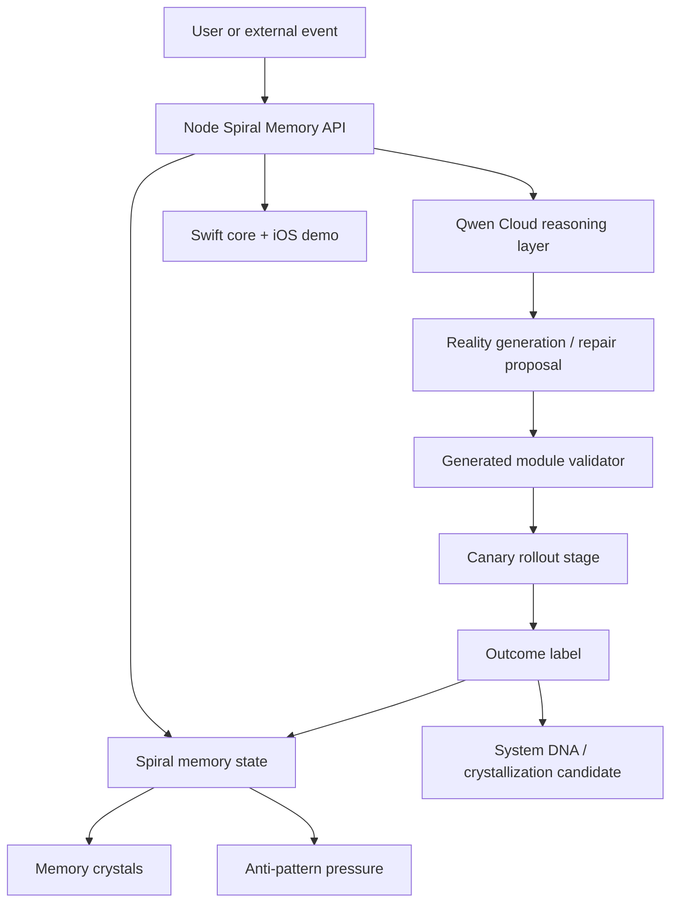

# Architecture

AI-Fi Spiral Memory OS is a memory-first agent architecture. It uses Qwen Cloud for reasoning, a local spiral memory runtime for persistence semantics, and outcome labels to decide whether a memory becomes a pattern, anti-pattern, or observation.



## Major Components

### Qwen Cloud Reasoning

[`backend/qwen-cloud-client.cjs`](../backend/qwen-cloud-client.cjs) calls Qwen through Alibaba Cloud's OpenAI-compatible chat API. Qwen proposes memory events, repair quests, and structured behavioral updates.

### Spiral Memory

The demo stores treatment traces, memory crystals, active questlines, generated modules, and game-truth labels. This is intentionally small enough for judges to inspect, while preserving the architecture of persistent experience becoming behavioral pressure.

### Anti-Pattern Pressure

Negative experiences are not hidden. They become repair memories and anti-patterns that can change future recommendations.

### Module Governance

Generated module proposals pass through a validator before activation. This keeps self-improvement auditable and prevents generated modules from reaching finance or credential-related capabilities.

### Swift Core

The Swift package models the living agent state, evolution engine, generated modules, and simulation flow.

### Finance Isolation

This public repo is not a trading bot. It is the memory operating-system slice. The finance boundary is documented in [`FINANCE_ISOLATION.md`](../FINANCE_ISOLATION.md).

## Why This Matters

Most agent memory systems retrieve facts. AI-Fi Spiral Memory OS tries to convert experience into governed behavioral change:

```text
remember -> reason -> act -> verify -> adapt
```

That loop is the project.
